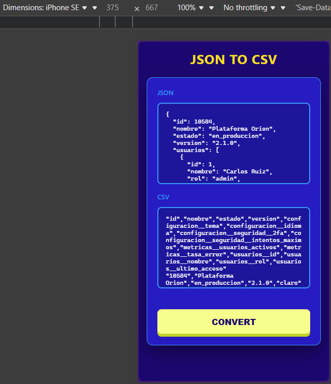
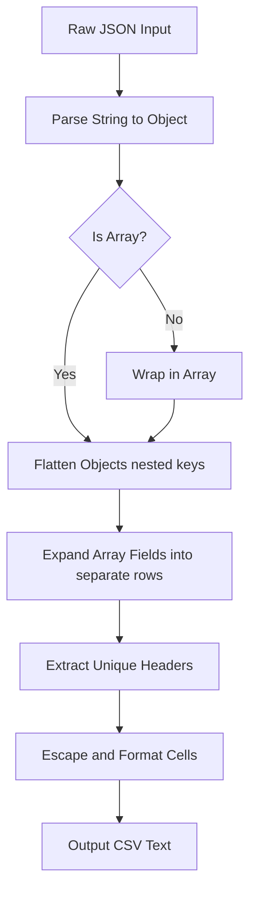

# JSON to CSV Converter

---

**🤖 AI Generation**
This project, including its core recursive flattening logic and layout styling, was developed with the assistance of an AI coding assistant. The AI helped architect the recursive property `flattenObject()` algorithm, the `expandRows()` logic to gracefully convert nested array structures into table rows, and the responsive cross-device CSS definitions.

---

[JSON to CSV Converter 📥](https://axlgoze.github.io/json-to-csv/)



A fast, robust, and client-side web application for converting complex JSON objects and arrays into comma-separated values (CSV). What makes this tool special is its ability to handle deep object nesting (by flattening keys with a `__` separator) and array fields (by expanding them into multiple rows) to ensure data is correctly tabulated.

**Tech Stack:**
* **Languages:** HTML5, CSS3, JavaScript (ES6+).
* **Tools/Methodologies:** BEM Methodology, DOM Manipulation, Custom CSS properties (variables), Responsive Design.

---

## Visual Flow Map (Architecture)



## Design & Roadmap

Roadmap:

- [x] Basic HTML/CSS form and UI layout.
- [x] Basic JSON parsing and basic flat object to CSV conversion.
- [x] Form validation and error state UI handling.
- [x] Nested object flattening support (`__` syntax).
- [x] Array expansion support (one row per item) for complex dataset handling.
- [x] Responsive layout across Mobile, Tablet, and Desktop resolutions.
- [x] Add support for downloading the CSV directly as a `.csv` file.
- [x] Add feature to automatically copy output to the clipboard.

## Contribution & Testing
### How to Contribute

Feel free to open issues or submit pull requests. If editing the conversion logic, please ensure your code handles both primitive and nested object arrays inside `expandRows()`.

### Testing

Test with nested JSON to verify the `flattenObject` and `expandRows` coordination:
```json
{
  "id": 10584,
  "usuarios": [
    { "nombre": "Carlos" },
    { "nombre": "Ana" }
  ],
  "configuracion": {
    "tema": "claro"
  }
}
```

## Lessons Learned

- Architecting recursive object flattening (`flattenObject`) without polluting the global scope.
- Distinguishing between primitive arrays and object arrays for smart dataset row expansion.
- Implementing an elegant, fluid responsive CSS layout using the BEM methodology.

---
### About me
[LinkedIn 🔗](https://www.linkedin.com/in/axel-reyes-wd/)
